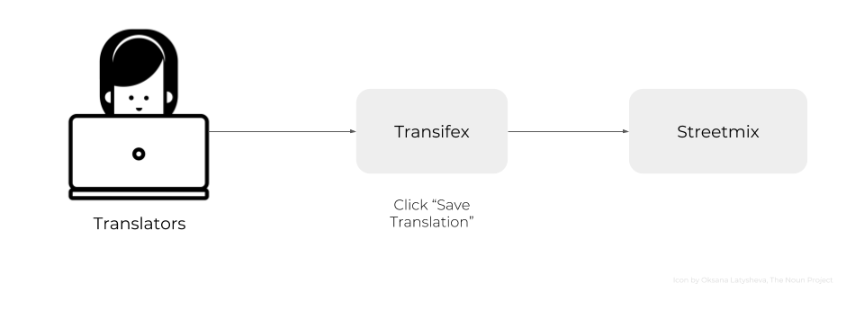
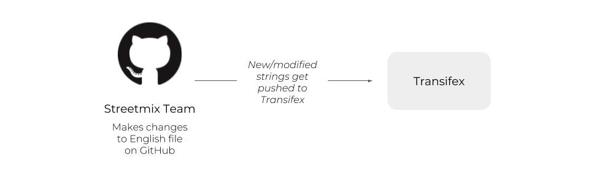
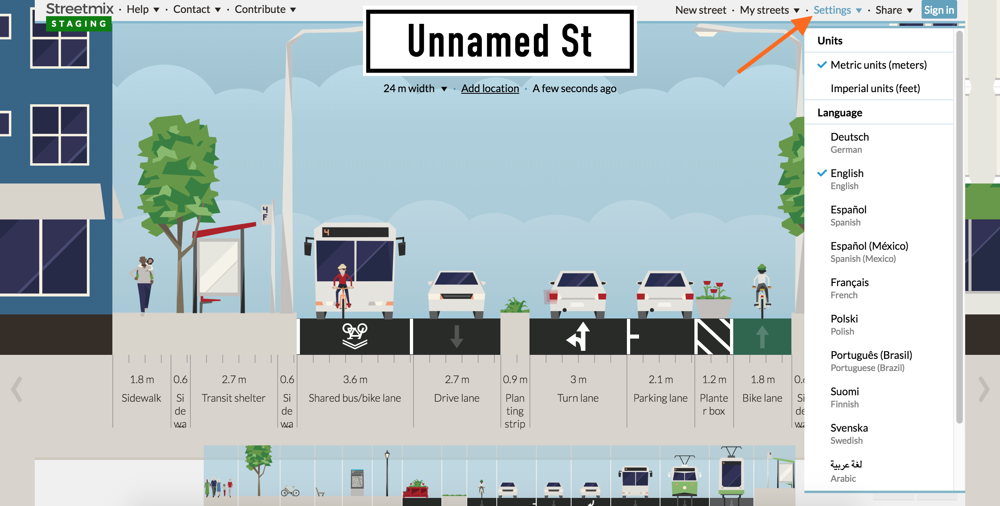
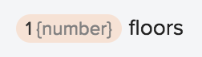
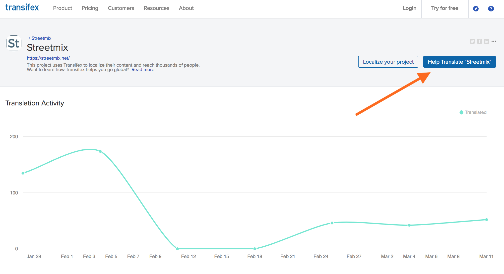
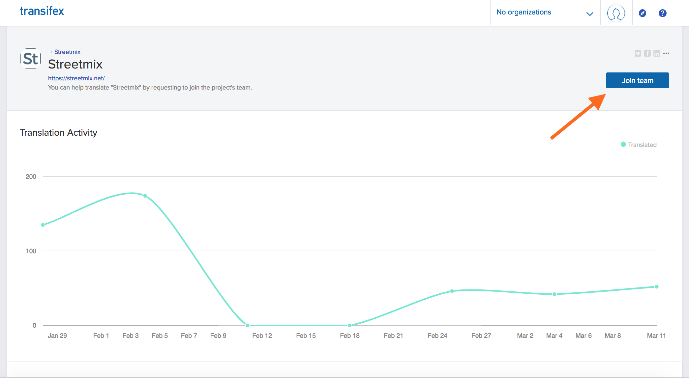
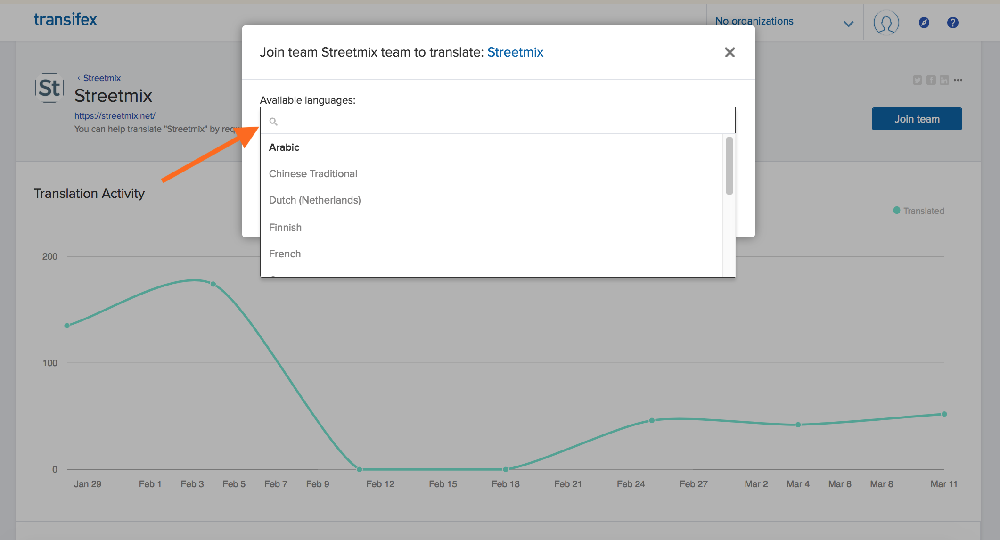
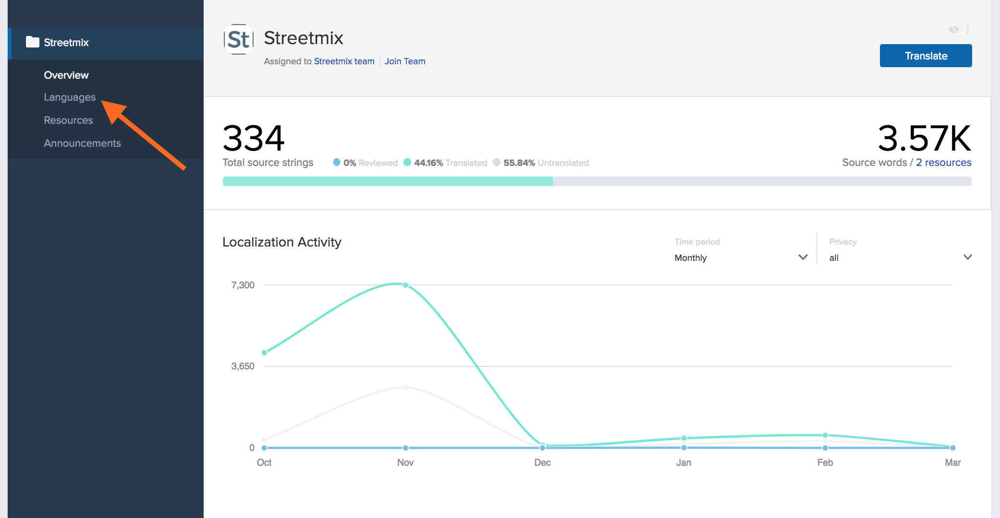
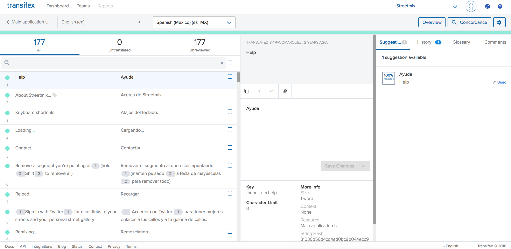
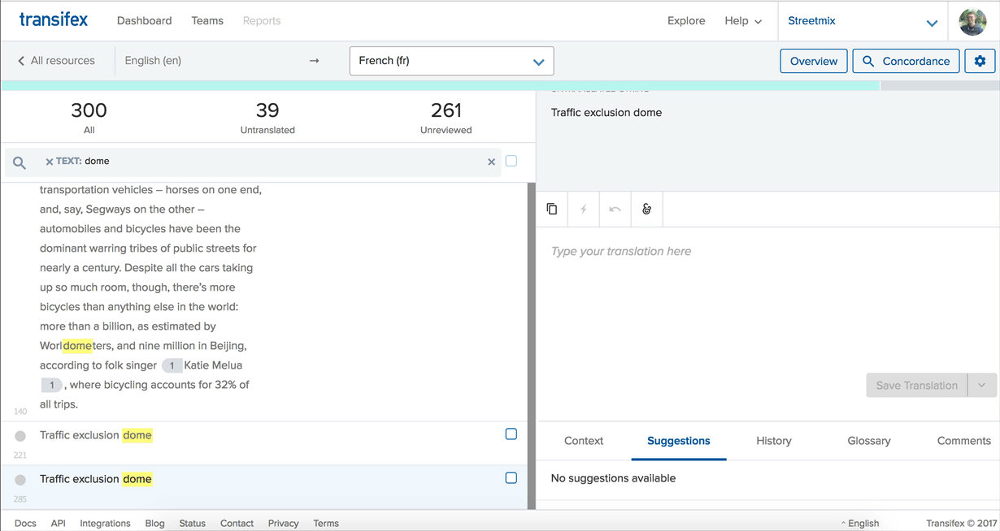

# New translator guide

Welcome to the Streetmix translation team! Your contributions are invaluable in making Streetmix accessible to non-English-speaking countries around the world, and for communities that speak languages other than English. Let's help you get started!

## Overview

Translators do not need programming expertise to translate Streetmix! We use a few tools and terms that translators will become familiar with:

- We use [Transifex](https://www.transifex.com/) to manage different translations, or _locales_. Translators will use this interface to translate English text, or _strings_, into strings of another language. We call this translation process _localization_.
- We use [Discord](https://strt.mx/discord) for real-time communication between translators at Streetmix team members. Whenever you have a question about how a string is used, or how it should be translated, this is the place to get answers.
- We use a _staging server_ with a test instance of Streetmix in order to preview translated strings in real time. Whatever changes you make in Transifex should instantaneously appear on the staging server, allowing you to see your translation in context.

Localization is an iterative process. We may go through several round of iteration to ensure that localizations meet our high standards for quality. Once complete, we will turn on that language, or _ship_ it, to our production server for all users of Streetmix.

We'll take a closer look at each tool below.

## How it works

We manage translations through the Transifex platform.

The staging instance of Streetmix is constantly communicating with Transifex. When you finish a translation in Transifex, Streetmix fetches it and displays it.

Sometimes, there are updates or additions to the original, or _source_, English strings. When this occurs, the Streetmix team will make changes to the English files on GitHub. Transifex updates its source strings from GitHub twice a day.

## Seeing translations live

The most important part about translating is seeing your hard work in Transifex show up live in the application! You can do this by visiting [the staging server](http://streetmix-staging.herokuapp.com) and logging in to view or create your user account there. (Because it's a staging server, it uses a separate database and different user accounts from the main instance.)

Let someone on the team know your user account name on the staging server so that we can give you "translator" role.

Once you have the "translator" role on the staging server, all incomplete or in-progress languages are available for translators to test! You can view them in the **"Settings" dropdown menu** in the upper right.

This is a really good way of visualizing how your translated text works in the real application. Maybe in the editor it's not clear whether something should be capitalized or how long a text string can be, or maybe it's not clear what the proper translation should be. _Seeing it in Streetmix directly provides context that allows you to go back and clarify any translations._

Also, if a translation is expected to show up, and it doesn't, please make a note of it (see [how to report problems below](#reporting-issues)). It might be that the application is not hooked up to the correct translation yet. Or it might be that the text showed up in another part of the application you didn't expect and is hard to get to (like an error page).

## Glossary {#translation-glossary}

Before you get started, here are some terms that you should get familiar with.

**Issue:** This is when there is a problem/error with one of the original English strings. When you add an issue, the project administrator will get a notification.

**Key:** Keys are unique identifiers for each string. An example is: `buildings.wide.name`.

**Placeholders:** These are what we use to store parts of a string that don't need to be translated. All you have to do for these is when you see one, click on it and it will be inserted into the translation in the appropriate place. Here is an example of one:

**Resource:** We have 2 main resources: the Main application UI (`main.json` file) and Segment info (`segment-info.json` file). Resource is just a fancy word used to indicate which of these files a string is in.

**Strings:** These are chunks of text in the user interface that we need to translate. "My streets" (a menu button in the top right corner of Streetmix) is one example of a string, and "Sidewalk with a lamp" (a segment) is another.

**TM:** TM stands for "translation memory". If you see "TRANSLATED BY TM" in the Transifex interface, that means the string was auto-completed by Transifex because it identified an identical string that was translated before.

**UI:** UI means "user interface". This refers to what people see when they use an app. You will be working in the Transifex UI and your translations will show up as a finished product in the Streetmix UI.

## Using Transifex

### Join the team

Start by going our [Transifex project page](https://www.transifex.com/streetmix/streetmix/).

If you are not logged in or don't have an account yet, you will need to click the "Help Translate Streetmix" button and you will be prompted to log in or create an account.

:::caution

The Transifex interface can take some getting used to. If something doesn't match a screenshot, let us know. It's most likely that there's some permissions problems, like we did not give you the correct editing privileges for your account. If it's because something in their interface actually changed, we'll update this accordingly.

:::

Once you create your account, you may have to confirm your email address. Then, navigate back to the [Transifex project page](https://www.transifex.com/streetmix/streetmix/) and you should see a blue button that says "Join Team".

Click that button and then select which language you would like to be added as a translator for. If you would like to translate multiple languages, you can join another language later on by going to the _Languages_ page, selecting a language, and then clicking "Join Team".

After requesting to join a language, you should receive a confirmation message. Hang tight and a Streetmix project administrator will approve your request.

### Getting started

Once your request has been approved, you should see the following when you go back to the [Transifex project page](https://www.transifex.com/streetmix/streetmix/). From here, select _Languages_.

The next screen will show different "Resources". _Resources_ are different categories of text that Streetmix uses. Right now there are two. "Main application" is anything that Streetmix uses in the UI, which is almost all the text. "Segment info" is specifically text that is used for each segment (like car lanes or sidewalks). Main application text is the highest priority text to translate, followed by names of segments in the segment info text. Descriptions in segment info is more complex, and might not be up to date or as relevant for other countries and languages right now, so that is the lowest priority.

If you click on a resource, such as "Main application," you will see a popup with more information. From here, click the large "Translate" button on the right.

The next screen is the main translation UI where you will be spending most of your time.

On the left you will see a list of all the _strings_ (phrases/sections of text to be translated) in English followed by its translation into your language, if already there. On the right is where you will make the translation. When you are looking for a specific string, filter them by using the search bar.

You will also see a series of tabs (_Suggestions, History, etc._) that can help you create a translation depending on the context. The first is _suggestions_ -- here Transifex will display similar strings to the one you are translating. This can help you see language that other translators have used for similar strings. However, do not copy and paste this as it is probably for a different string.

Next, there is the _history_ tab. This lets you see prior translations for the string. It is really helpful when an English string is updated, as it lets you retrieve previous translations, and then tweak the string from there.

The last two tabs are _glossary_ and _comments_. We are not utilizing the glossary yet, but comments are where you will tell the team anything that you think is important to note about the string. It is also where you can [report issues](#reporting-issues) with the string (in some cases there may be an error in the English string, so please tell us!).

### Placeholders

Some of our strings have placeholders. These are what we use to represent elements in a string that do not need to be translated. This can be a link to a webpage, HTML markup, or text being inserted from another part of the app. Whatever the case, just know that you do not need to translate these. All you have to do is copy them over from the English version of the string. This is a simple process: the placeholders will show up as purple or orange buttons, and you just need to click on it in the English version to copy it over.

### Plurals

There is a special way to deal with plural strings in Transifex. They can be inputted in Transifex's UI as shown in the animation below. Some languages have more plural forms than others, and Transifex takes this into account based on [a Unicode standard](http://www.unicode.org/cldr/charts/latest/supplemental/language_plural_rules.html).

### Translation string changes

Sometimes there will be updates to the English strings. Transifex will detect those and require a new translation to be submitted. However, have no fear! There is a handy dandy "History" feature that lets you retrieve your previous translations of the string, and then tweak the string from there.

## Need more help?

Refer to the [Transifex documentation](http://docs.transifex.com/) if you need more help. A good place to start is the [Transifex web editor tutorial](http://docs.transifex.com/tutorials/txeditor/).

### FAQ & Discord chat

As questions come in, we will add them to the [Frequently Asked Questions page](faq).

If your question isn't answered there, come ask the Streetmix community on [Discord](https://strt.mx/discord)! Please ask translation-related questions in the #translations channel.

### Reporting issues

If you ever see an error on Transifex, please mark it. ([Instructions are here.](https://docs.transifex.com/translation/tools-in-the-editor#comments-and-issues))

If there is a difficult or confusing string, please add a comment on Transifex. You can also put any notes you think are important for the string there. This is the same place where you would mark something as an issue (just click "Add as issue" instead of "Add".

For issues that are larger than one specific string, please bring this up to the Streetmix community. There are two ways you can do this:

1. Join our [Discord server](https://strt.mx/discord) and post in the _#translations_ channel.

2. [Create an issue on GitHub](https://github.com/streetmix/streetmix/issues/new).
